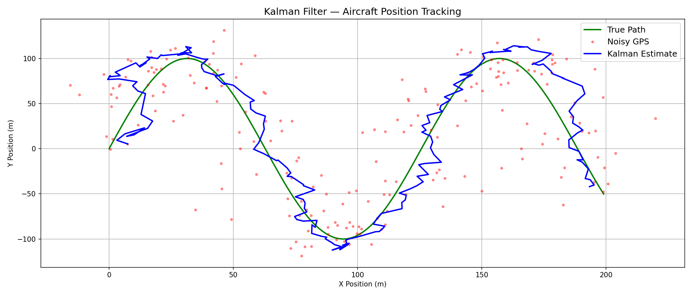

# Kalman Filter — Aircraft Position Tracking

Implementation of a Kalman filter from scratch in Python for aircraft position 
estimation using noisy GPS measurements.

## What it does
Simulates an aircraft flying a curved trajectory with realistic GPS noise (±15m).
The Kalman filter fuses the noisy measurements with a constant-velocity physics 
model to produce a smooth, accurate position estimate.

## Key concepts demonstrated
- State estimation with a 4D state vector [x, y, vx, vy]
- Predict/update cycle (physics model + sensor fusion)
- Q/R tuning — bias-variance tradeoff in state estimation
- Kalman gain computation

## Results

## Tech
Python, NumPy, Matplotlib

## Context
Built as part of self-directed study in control systems and aerospace engineering 
fundamentals. Next step: apply this filter to real-time object tracking using 
OpenCV and a camera.
